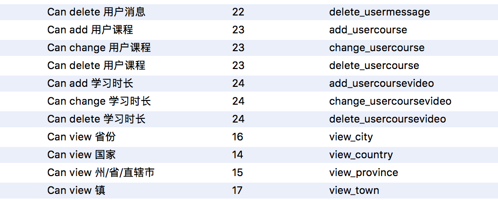

#权限

```
	class AbstractUser(AbstractBaseUser,PermissionsMixin):
		pass
	class UserProfile(AbstractUser):
		pass
		
		
	权限类
	PermissionsMixin:
		is_superuser = models.BooleanField(
        _('superuser status'),
        default=False,
        help_text=_(
            'Designates that this user has all permissions without '
            'explicitly assigning them.'
        ),
    )
    groups = models.ManyToManyField(
        Group,
        verbose_name=_('groups'),
        blank=True,
        help_text=_(
            'The groups this user belongs to. A user will get all permissions '
            'granted to each of their groups.'
        ),
        related_name="user_set",
        related_query_name="user",
    )
    user_permissions = models.ManyToManyField(
        Permission,
        verbose_name=_('user permissions'),
        blank=True,
        help_text=_('Specific permissions for this user.'),
        related_name="user_set",
        related_query_name="user",
    )

    class Meta:
        abstract = True

    def get_group_permissions(self, obj=None):
        pass

    def get_all_permissions(self, obj=None):
        pass

    def has_perm(self, perm, obj=None):
		pass

    def has_perms(self, perm_list, obj=None):
		pass

    def has_module_perms(self, app_label):
       pass
```



```
权限命名
	增 add
	删 delete
	改 change
	查 view
	
权限请求流程
	Admin  ->  USER  -->  PermissionsMixin -- > AUTHENTICATION_BACKENDS(ModelBackend)
	
自定义权限
	class Model(model.Model):
		xx =
		oo = 
		class Meta:
			permissions = (
	            ("AAAA", "Can see available tasks"),
	            ("BBBB", "Can change the status of tasks"),
	            ("CCCC", "Can remove a task by setting its status as closed"),
	        )
        
    操作权限 
    	one_user.has_perm("APPNAME.AAAAA")
    	判断是否有该权限  流程见上
		
```