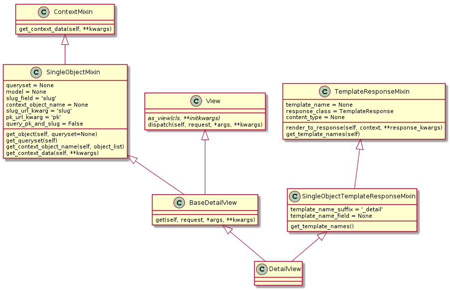

#View(基于类的视图)

基类

```
class ContextMixin:pass 
	提供模板 渲染参数 的功能
	def get_context_data(self, **kwargs):pass
		return content
	
class View(object):
	生成Response 的Action
	继承View 事件流程
		as_view()->options配置 -> 通过request.method调用对应 （get/post）方法返回response
		
	提供请求方式限制
	http_method_names = []
	或者 def http_method_not_allowed(self, request, *args, **kwargs):
	变为函数视图
	 @classonlymethod
    def as_view(cls, **initkwargs):
    	pass
    def options(self, request, *args, **kwargs):
    	生成response 设置一些默认参数
    		Allow | Content-Length ...
    	return response
    	pass
    	
    def dispatch(self, request, *args, **kwargs):
    	//不需要重写
    	//根据你的请求方法 GET / Post /UPdate  来调用对应方法
    	def get(self, request, *args, **kwargs):pass return sponse
    	def post(self, request, *args, **kwargs):pass rerurn response
    
class TemplateResponseMixin:(object):
	提供一种模板转换方式 继承这个就是需要渲染模板
	修改 | 继承类包含render_to_response 改变默认行为
	
	template_name = None 指定模板
    template_engine = None 指定渲染引擎
    response_class = TemplateResponse 模板Response类
    content_type = None response内容类型
	模板配置
	def get_template_names(self):return [template_name]
	模板渲染  这里需要在get/post 里面调用
	def render_to_response(self, context, **response_kwargs):
	
class TemplateView(TemplateResponseMixin, ContextMixin, View):
	重写View 的事件分配GET任务
	def get():
		调用 TemplateResponseMixin.render_to_response
		pass 
	
///	
class SingleObjectMixin(ContextMixin):
	单个model 和 提供渲染参数
    model = None 类型
    queryset = None 指定查询对象  model | queryset指定一个
    slug_field = 'slug' 
    context_object_name = None 指定上下面中参数{"context_object_name":Model}
    slug_url_kwarg = 'slug'
    pk_url_kwarg = 'pk' 默认参数名称 url匹配参数
    query_pk_and_slug = False
    
    pk 是Django进行主键查询的依据  url匹配提供就可
    
    
    def get_object(self, queryset=None):
    	get_queryset中获取
    	自定义查询
    def get_queryset(self):pass
    	查询all() 可进行过滤等操作
    	 if self.queryset is None:
            if self.model:
                return self.model._default_manager.all()
            else:
                raise ImproperlyConfigured（)
        return self.queryset.all()
  
 class BaseDetailView(SingleObjectMixin, View):
 	自定义Get返回Response
	  def get(self, request, *args, **kwargs):
        context = self.get_context_data(**kwargs)
        return self.render_to_response(context)
		
class SingleObjectTemplateResponseMixin(TemplateResponseMixin):
	template_name_field = None
    template_name_suffix = '_detail'
    def get_template_names(self):
    	pass
///
class MultipleObjectMixin(ContextMixin):
    allow_empty = True 容许为空
    queryset = None 指定查询对象    model | queryset指定一个
    model = None 模型
    paginate_by = 10  分页个数
    paginate_orphans = 0
    context_object_name = None 结果在上下文中的key{"context_object_name":res}
    paginator_class = Paginator
    page_kwarg = 'page'  页码参数名
    ordering = None   是否倒叙
    
    def get_queryset(self):
    	pass
   
 class MultipleObjectTemplateResponseMixin(TemplateResponseMixin):
 	template_name_suffix = '_list'
 	def get_template_names(self):
 		pass
 
class BaseListView(MultipleObjectMixin, View):
 	自定义Get
 	def get(self, request, *args, **kwargs):
	 	return response
///
```

视图

* DetailView | ListView | TemplateView | RedirectView 参数解释

	```
	参数
		context_object_name
		paginate_by
		model
	设置渠道
		> 类内部设置
		> as_View(xx=xx)
		> url匹配
	自定义 （不推荐修改变量名称  仅仅修改 变量的值）
		pk_url_kwarg = "pk" 
		系统使用 pk_url_kwarg 得到 "pk" 使用self.kwargs.pk的值 作为组件的值进行查询
		修改 pk_url_kwarg = "id" 你就需要url匹配id值 作为主键的值
		
	
	```

* TemplateView(TemplateResponseMixin, ContextMixin, View):
	
	```
自定义
	1：创建子类
	2：指定模板 参数指定
	3：重写get_context_data等需要重写方法
		exam:url(r"(?P<pk>\d+_.+)/$",BlogDetaile.as_view(),{"name":"ZZH"}),
		
		template_name=""
		....
		def get_context_data(self,**kwargs[url配置 或者 url匹配到的值]):
			context=super(BlogDetaile,self).get_context_data(**kwargs)
			con=kwargs.get("id",1)
			blog=Blog.objects.get(id=con.split("_")[0])
			context["object"]=blog
			return context
		
	```
	
* RedirectView(View)

	```
	class RedirectView{
		permanent = False  是否为永久条301 302
		url = ' # 要跳转的网址
   		pattern_name = None 不指定url  使用这个参数 反向解析url
   		query_string = False  是否传递GET的参数到跳转网址
    }
    url(r'^go-to-django/$', RedirectView.as_view(url=., permanent=.), name='go-to-django'),
	```

* DetailView(SingleObjectTemplateResponseMixin, BaseDetailView): 仅仅展示一条数据
	
	
	```
	1：创建子类
	2：指定模板 参数指定
	3：重写get_context_data等需要重写方法
	
	A:url(r'^blog/(?P<pk>\d+)/(?P<slug>[-_\w]+)/$', BlogDetailView.as_view(
		设置类属性model = BlogModal
	), name='detail'),  
	B:url(r'^ blog/(\d+)/(?P<slug>[-_\w]+)/$', BlogDetailView.as_view(
		设置类属性model = BlogModal
	), name='detail')  
	* 如果使用默认 这里的参数名 pk | sulg 这里系统默认pk的值进行查询主键
	* 自定义
		1:
			pk_url_kwarg = "IDD"
			url(r'^blog/(?P<IDD>\d+)/(?P<slug>[-_\w]+)/$', BlogDetailView.as_view(), name='detail'),
		
			获取参数
			MYID =self.kwargs.get(self.IDD_URL_KWarg,None)
	
	class BlogDetailView(DetailView):
		model = BlogModal
		template_name = "blog_detail.html"
		//context_object_name = 'persons'
		def get_object(self,queryset=None):
			参数获取 self.kwargs.xxx
	        query=self.get_queryset()  
	        try:  
	            obj=query[pnum-1]
	        except IndexError:  
	            raise Http404  
	        return obj  
	        {
	        object = super(AuthorDetailView, self).get_object()  这里是使用 PK 字段
        	object.last_accessed = timezone.now()    另外操作
        	object.save()
        	return object
        	}
	   	def get_queryset(self):
	   		return super(AuthorDetailView,self).get_queryset()
	        
    	def get_context_data(self,**kwargs):  
        	context=super(AuthorDetailView,self).get_context_data(**kwargs) 
        	参数获取 self.kwargs.xxx
        	return context  
	
		
	```


	
* class ListView(MultipleObjectTemplateResponseMixin, BaseListView):
	

	```
	1：创建子类
	2：指定模板 参数指定
	3：重写get_context_data等需要重写方法
	
	A:url(r'^blog/(?P<pk>\d+)/(?P<page>\d+)/$', BlogDetailView.as_view(
		设置类属性  model = BlogModal
	), name='detail'),  
	B:url(r'^ blog/(\d+)/(?P<slug>[-_\w]+)/?page=100', BlogDetailView.as_view(
		设置类属性 model = BlogModal
	), name='detail')  
	* 如果使用默认 这里的参数名 pk | sulg 这里系统默认pk的值进行查询主键
	* 自定义
		1:
			pk_url_kwarg = "IDD"
			url(r'^blog/(?P<IDD>\d+)/(?P<slug>[-_\w]+)/$', BlogListView.as_view(), name='list'),
			其他代码无需修改
		
			MYID =self.kwargs.get(self.IDD_URL_KWarg,None)
	
	class BlogListView(ListView):
		model = BlogModal
		template_name = "blog_detail.html"
		//context_object_name = 'persons'
		paginate_by = 10  分页个数
       page_kwarg = 'page'  页码参数名 url参数 或者 截取url
		
	   	def get_queryset(self):
	   		return super(UserListView,self).get_queryset()
	        
    	def get_context_data(self,**kwargs):  
        	context= super(UserListView,self).get_context_data(**kwargs)  
        	参数获取 self.kwargs.xxx
        	return context 
	```
	