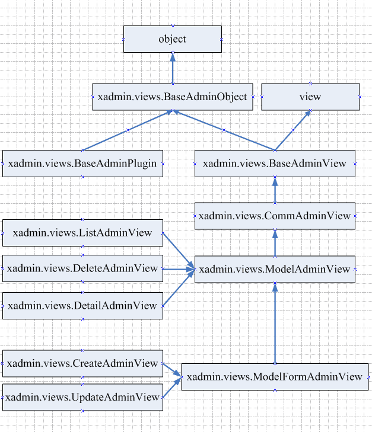
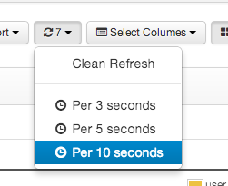
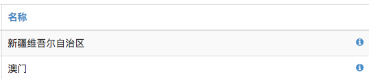
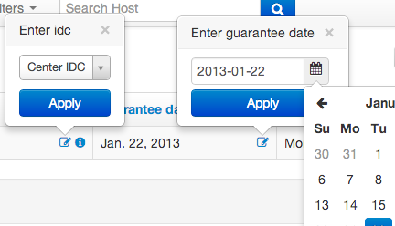

#替换Django admin使用xadmin

* 源码下载

	```
		https://github.com/sshwsfc/xadmin
	```
* 依赖安装
	
	```
	1	
		pip install xadmin
		pip uninstall xadmin  会保留依赖
	
	2：pip install django-import-export
	3: pip install  six
	4: pip install future
	```
* 配置
	
	```
	1:创建extra_apps文件夹 加入路径搜索
		sys.path.append(os.path.join(BASE_DIR,"extra_apps"))
	2：设置app
		"extra_Apps.xadmin",
	    "crispy_forms"
	3：urls配置
		from Extra_Apps import xadmin
		urlpatterns = [
		    # url(r'^admin/', admin.site.urls),
		    url(r'^xadmin/', xadmin.site.urls),
		]
	4:数据库同步
		makemigrations
	```

* 模型注册
	
	```
	User不需要注册
	1:在App下创建admix.py文件  
		from Extra_Apps import xadmin
		from .models import EmailVerify
		class EmailVerifyAdmin(object):
			list_filter =[] 用于指明需要显示的属性
			search_fields =[] 指定可以用于搜索的属性
			free_query_filter = True
			list_export = ('xls', xml', 'json')支持数据导出
				excel需要安装xlwt.
			show_bookmarks = True 开启书签
			list_bookmarks = [
				{
				'title': "Female",         # 书签的名称, 显示在书签菜单中
		        'query': {'gender': True}, # 过滤参数, 是标准的 queryset 过滤
		        'order': ('-age'),         # 排序参数
		        'cols': ('first_name', 'age', 'phones'),  # 显示的列
		        'search': 'Tom'    # 搜索参数, 指定搜索的内容
		        },
		      ...
				]
			refresh_times = (3, 5)提供一个自动刷新列表的功能 2s 或者5s 见底部图片
			show_all_rel_details = True
   		 	show_detail_fields = []
   		 		显示属性详情 见下图
   		 	
   		 	list_editable = [xx]
   		 		直接编辑属性 见下图
   		 	
		xadmin.site.register(EmailVerify,EmailVerifyAdmin);
	```
* Xadmin  配置

	* 主题修改 (USer App下) xadmin.views.BaseAdminView
	
		```
			# _*_ coding: utf-8 _*_
			import xadmin
			from xadmin import views
			
			class BaseSetting(object):
			    enable_themes=True
			    use_bootswatch=True

			xadmin.site.register(views.BaseAdminView,BaseSetting)
			
		```
	* 站点配置 xadmin.views.CommAdminView
		
		```
			class GlobalSettings(object):
				site_title="猪猪系统"
		   	 	site_footer="我的公司"
		   	 	menu_style="accordion"
		   	 	
		   	 xadmin.site.register(CommAdminView,GlobalSettings);
		```
	* xadmin.views.ModelAdminView
	* 。。。。

* Xadmin  View

	
	
	```
		BaseAdminView: 所有AdminView的基础类，注册在该View上的插件可以影响所有的AdminView.

		CommAdminView:用户已经登录后显示的View，也是所有登陆后View的基础类。该View主要作用是创建了Xadmin的通用元素，例如：系统菜单，用户信息等。插件可以通过注册该View来修改这些信息。
		
		ModelAdminView：基于Model的AdminView的基础类，注册的插件可以影响所有基于Model的View。
		
		ListAdminView:Model列表页面View。
		
		DeleteAdminView:Model删除页面View。
		
		DetailAdminView:Model详情页面View。
		
		ModelFormAdminView:Model编辑页面View。
		
		CreateAdminView:Model创建页面View。
		
		UpdateAdminView:Model修改页面View。
	```
* Xadmin 插件制作
	* Action
	* 过滤器

* 刷新功能

	
	
* 属性详情

	
	
* 编辑属性

	